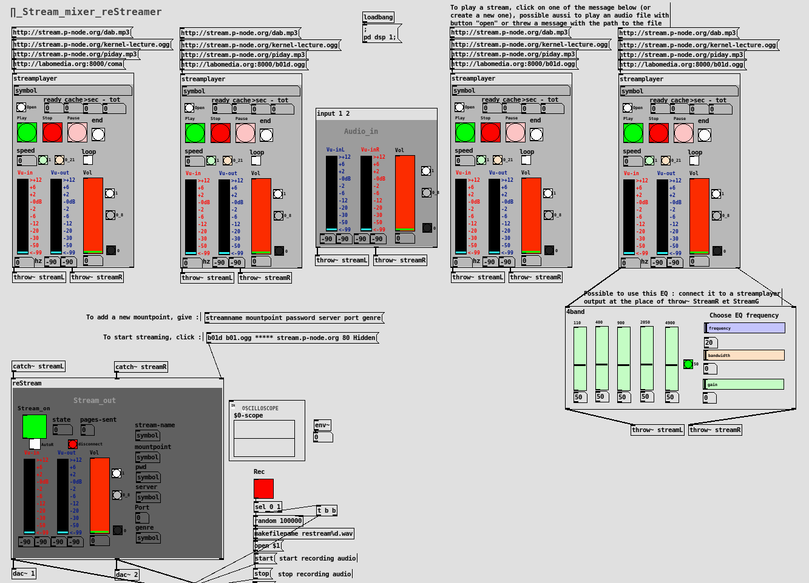

# A-Pd-Stream-Mixer-reStreamer-
a Pure Data patch that allows to play several audio streams and send the mix to an icecast server

This patch involves several dependencies (Pd libraries) :

  * zexy
  * pdogg
  * ggee
  * readanysf~
  
Possible to install theses librairies with Deken or with your package manager (Linux Debian / ubuntu)

To install Pure data : https://puredata.info/ or https://github.com/agraef/purr-data/releases

